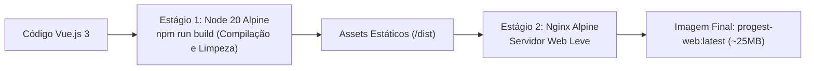

# 🏛️ Arquitetura e Componentes — Frontend

A arquitetura do **ProGest Frontend Web** foi construída sobre o ecossistema Vue 3 com foco em modularidade, separação de responsabilidades e alto desempenho.

---

## 🗂️ Estrutura de Diretórios (`src/`)

```
src/
├── assets/             # Imagens, logotipos oficiais do hospital e estilos globais
├── components/         # Componentes reutilizáveis (modais, tabelas, inputs de busca)
├── composables/        # Hooks reutilizáveis de lógica de interface
├── constants/          # Constantes estáticas da aplicação
├── functions/          # Camada de serviços e chamadas HTTP auxiliares
│   ├── cad_setores.js
│   ├── cad_usuario_setor.js
│   └── api_service.js
├── router/             # Configuração do Vue Router e Route Guards
│   └── index.js
├── utils/              # Funções utilitárias (formatação de moeda, datas, cookies)
│   └── setorCookie.js  # Gerenciamento de persistência do setor selecionado
├── views/              # Telas da aplicação
│   ├── Login.vue       # Tela de autenticação inicial
│   ├── SetorSelectionView.vue # Seleção de Polo e Setor de trabalho
│   ├── SetorAtualView.vue     # Painel principal operacional (Abas Estoque, Movimentações, Entrada)
│   ├── roleSolicitante/       # Telas exclusivas do Solicitante (ex: PedidosView.vue)
│   ├── cadastros/             # Telas administrativas (Usuários, Setores, Produtos, etc.)
│   └── relatorios/            # Telas de relatórios operacionais e regulatórios
├── vuex/               # Gerenciamento de estado global com Vuex
│   ├── store.js
│   ├── auth/           # Módulo de usuário, autenticação e tokens
│   └── estoque/        # Módulo de setor ativo, permissões e listas de estoque
├── App.vue             # Componente raiz da aplicação
└── main.js             # Ponto de entrada, injeção de plugins e axios
```

---

## 🚀 Ciclo de Comunicação com a API

A comunicação entre a SPA e o Backend Laravel ocorre através do **Axios**:
* **Base URL:** Determinada dinamicamente através da variável `VITE_API_URL` (em Docker local/produção aponta para `/api` no mesmo domínio, eliminando restrições de CORS).
* **Interceptor de Requisição:** Injeta automaticamente o token Sanctum (`Authorization: Bearer ...`) armazenado no `sessionStorage` ou `localStorage`.
* **Interceptor de Resposta:** Captura erros `401 Unauthorized` e redireciona imediatamente para a tela `/login`, limpando cookies e dados de sessão desatualizados.

---

## 🐳 Multi-Stage Docker Build e Servidor Nginx

A entrega em produção utiliza o padrão **Multi-stage Docker Build**, garantindo imagens enxutas e seguras:



### Configuração do Nginx (`nginx.conf`):
O Nginx está configurado com fallback para SPAs:
```nginx
location / {
    root /usr/share/nginx/html;
    index index.html;
    try_files $uri $uri/ /index.html;
}
```
Isso garante que rotas como `/setor-atual` ou `/pedidos` funcionem corretamente em recarregamentos de página (F5) sem retornar erro `404 Not Found`.
